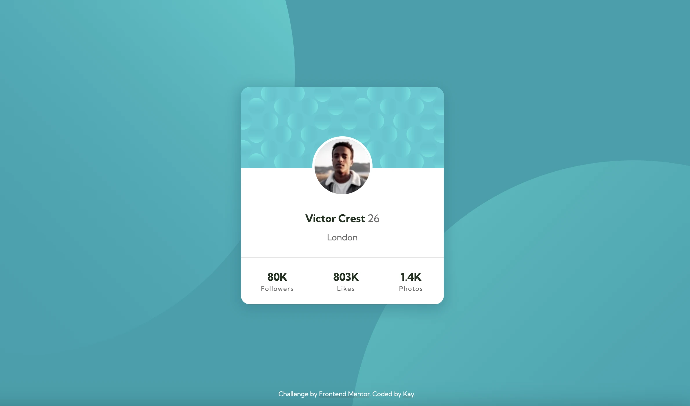

# Frontend Mentor - Profile card component solution

This is a solution to the [Profile card component challenge on Frontend Mentor](https://www.frontendmentor.io/challenges/profile-card-component-cfArpWshJ). Frontend Mentor challenges help you improve your coding skills by building realistic projects. 

## Table of contents

- [Overview](#overview)
  - [The challenge](#the-challenge)
  - [Screenshot](#screenshot)
  - [Links](#links)
- [My process](#my-process)
  - [Built with](#built-with)
  - [What I learned](#what-i-learned)
  - [Continued development](#continued-development)
  - [Useful resources](#useful-resources)
- [Author](#author)

## Overview

### The challenge

- Build out the project to the designs provided

### Screenshot

### Links

- Solution URL: [Add solution URL here](https://kayy-w.github.io/Profile-card)
- Live Site URL: [https://kayy-w.github.io/Profile-card](https://kayy-w.github.io/Profile-card)

## My process

I started with building the HTML and deciding what elements to use. I then added the background image on the body and started to style the 'main' - white background, rounded corners, drop shadow. Added flex (first time using this!) and started to style the text elements. Then added the profile image and the card top background. I tried a ':before' element but couldn't get it to work, then decided it would be better to add the background to the 'main' itself. Compared the live version to the design a lot to get everything just right and finally did the background with media queries so it looks ok on smaller screens.

### Built with

- Semantic HTML5 markup
- SCSS/CSS
- Flexbox

### What I learned

I learned about flexbox and how to use it. I'm hoping I've done this right!

### Continued development

I'm keen to learn more, keep practicing and build on this knowledge of HTML and CSS. I'd love to learn JS so I can start to bring my code to life a bit more.

### Useful resources

- [Udemy Complete Web Development Bootcamp](https://www.udemy.com/course/the-complete-web-development-bootcamp/) - This udemy course is absolutely brilliant. Great for going back to the basics of HTML & CSS and building on my existing development skills. Looking forward to getting to the JS section as I have very little knowledge of JS.
- [MDN web docs](https://developer.mozilla.org/en-US/docs) - Invaluable as always! Great for referring to when code doesn't quite work the way it should.

## Author

- Website / WIP - [Kay](https://www.kaywyeth.co.uk)
- Frontend Mentor - [@kayy-w](https://www.frontendmentor.io/profile/kayy-w)
- Twitter - [@kaywyeth](https://www.twitter.com/kaywyeth)